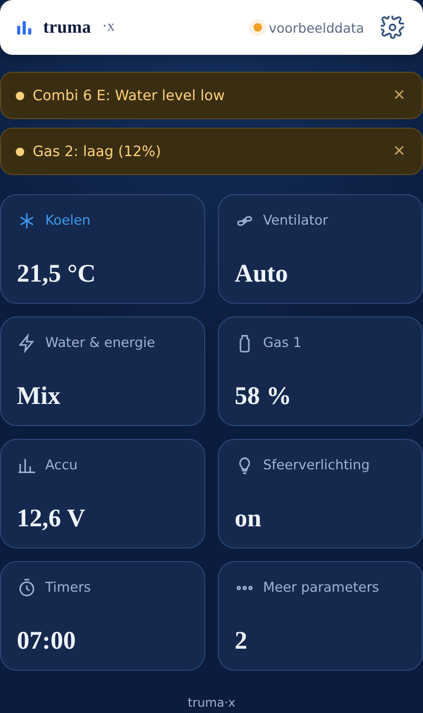
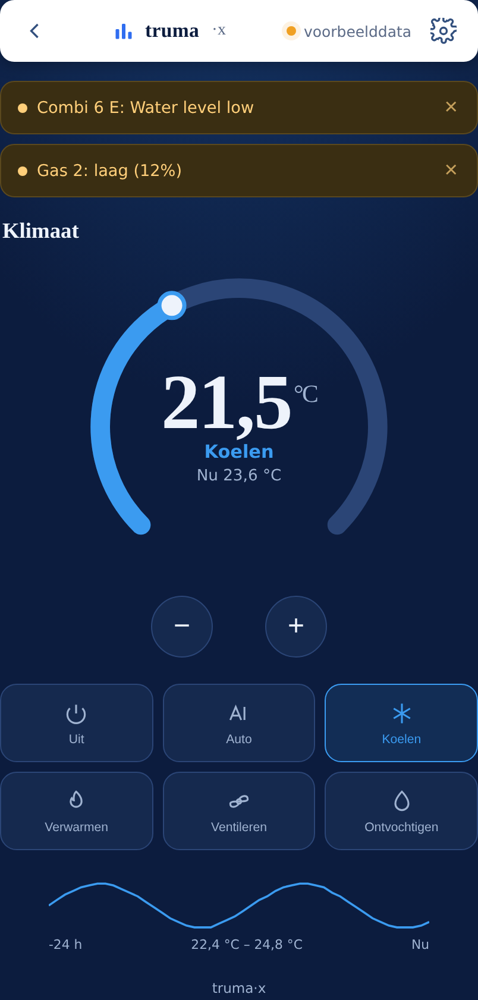
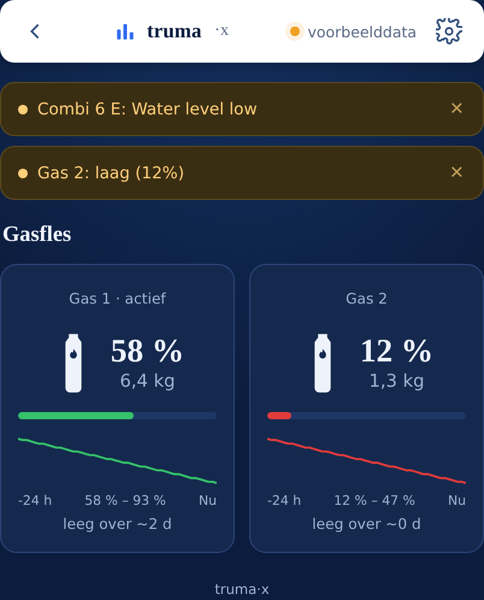
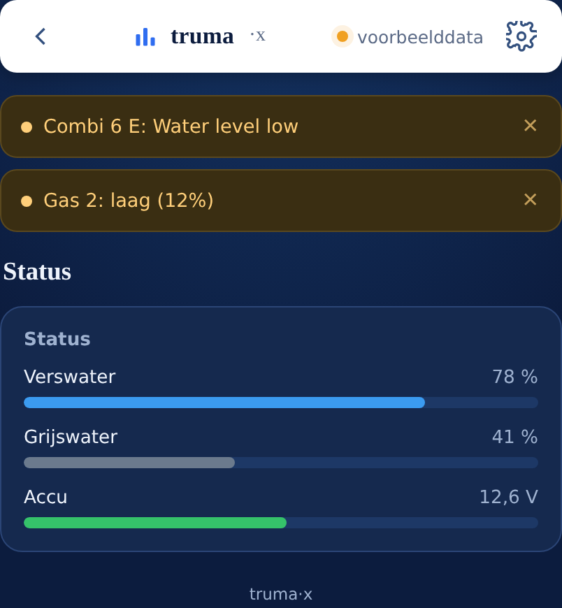
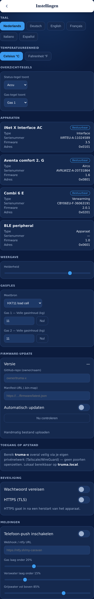

# truma-x

Zelf gebouwde, open, lokale webinterface voor het Truma iNet X-systeem (Combi-verwarming + Aventa-airco via het iNet X Panel), draaiend op een ESP32-S3. Geen Truma-cloud, geen abonnement — de ESP praat rechtstreeks over Bluetooth (BLE) met het paneel en serveert zelf een moderne, meertalige web-app.

De broncode staat in een privé-repository ([`Truma-X`](https://github.com/DaveRutten/Truma-X)). Deze repo (`Truma-X-Versions`) is publiek en bevat uitsluitend de gebouwde firmware (`.bin`-bestanden) per versie, zodat het apparaat zelf over-the-air kan updaten zonder dat de broncode openbaar hoeft te zijn.

## Wat werkt er nu

- **Klimaatbediening** — verwarmen/koelen/ventileren/ontvochtigen/auto, met een grote instelbare temperatuur-ring en een trendgrafiek van de laatste 24 uur.
- **Ventilator** — standen (auto/laag/midden/hoog/nacht), afgeleid uit wat het toestel zelf aanmeldt.
- **Water & energie** — energiebron als één keuze (gas / elektra / mix, met elektra-niveau), warmwaterstand.
- **Gasflessen** — percentage én kilo's per fles, met een instelbare volle-inhoud per fles, een trendlijn, en een "leeg over ~X dagen"-schatting. Meetbron is instelbaar: HX711-load cell (zelfbouw) of een GOK Senso4s-weegplaat (BLE, work in progress).
- **Status** — verswater, grijswater, accuspanning, elk met trend.
- **Timers** — bekijken, aan/uit zetten en bewerken.
- **Sfeerverlichting** — aan/uit.
- **Waarschuwingen** — storingen/lage-niveau-meldingen bovenaan, sluitbaar, met instelbare drempels.
- **Telefoon-push** — bij lage niveaus naar een eigen webhook (ntfy/Telegram/etc.), geen Truma-account nodig.
- **Apparatenoverzicht** — elk gekoppeld toestel met type, serienummer, firmwareversie en busadres, zoals het paneel dat zelf toont.
- **Instelbaar overzicht** — de tegels op het startscherm (status- en gastegel) zijn per apparaat aan te passen.
- **Meertalig** — Nederlands, Deutsch, English, Français, Italiano, Español, met correcte getalnotatie (bijv. "21,5 °C").
- **°C/°F instelbaar.**
- **Beveiliging** — optionele toegangscode voor de web-UI, uit te zetten/aanzetten en zelf in te stellen.
- **Veilige toegang op afstand** — geen eigen cloud; bedoeld om via je eigen VPN (bijv. Tailscale) bereikbaar te maken.
- **OTA-updates** — de ESP controleert zelf een publiek manifest (deze repo) op nieuwe versies en installeert ze, met automatische rollback als een update niet opstart.

## Wat nog niet af is

De BLE-laag die daadwerkelijk met het Panel X praat (`truma_ble`) is geschreven en compileert, maar nog niet getest op echte hardware — dat is de eerstvolgende stap. Tot die tijd draait de interface op voorbeelddata (zichtbaar aan de "voorbeelddata"-indicator rechtsboven). De protocol-laag eronder (framing, CBOR-encoding) is wél al host-getest.

## Screenshots

Alle schermen hieronder tonen de interface met voorbeelddata, gerenderd vanaf de actuele UI-code in de private repo.

### Overzicht
Startscherm met instelbare tegels — elke tegel opent de bijbehorende pagina.

### Klimaat
Grote temperatuur-ring, moduskeuze en een 24-uurs trendgrafiek.

### Gasflessen
Percentage én kilo's per fles, met trend en een "leeg over"-schatting.

### Status
Verswater, grijswater en accuspanning.

### Instellingen
Taal, eenheden, overzicht-tegels, apparatenlijst, gasfles-kalibratie, firmware-updates, beveiliging en meldingen — alles in één scherm.

## Firmware-updates (deze repo)

`firmware/latest.json` wijst naar de nieuwste `.bin` in `firmware/<versie>/truma-x.bin`. Elke versietag (`vX.Y.Z`) op de private repo bouwt via GitHub Actions automatisch een nieuwe release hierheen. Het apparaat zelf leest dit manifest en werkt zichzelf bij (optioneel automatisch, in te stellen in de app).

## Hardware

- ESP32-S3 (met PSRAM)
- Optioneel: HX711 + load cell (gasfles wegen) of een GOK Senso4s-weegplaat
- Verbinding met het Truma iNet X Panel via BLE — geen extra bekabeling naar de Combi/Aventa nodig
